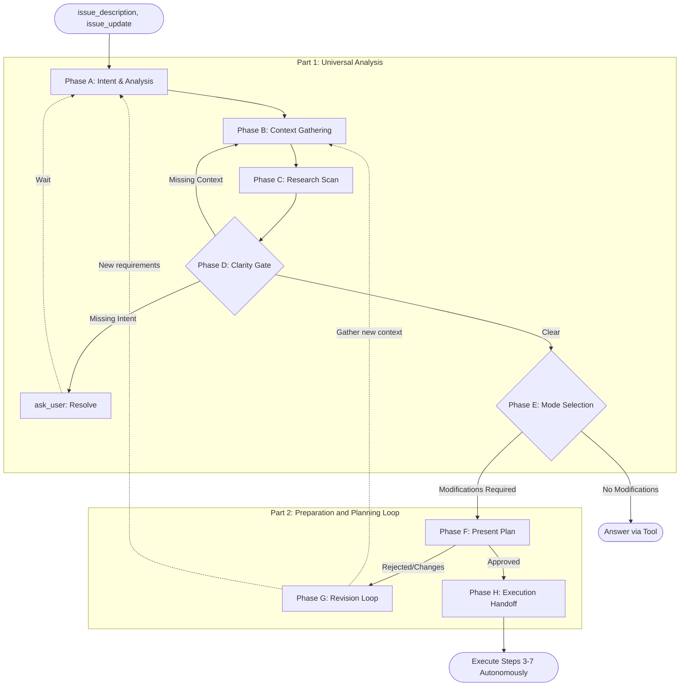

# CORE WORKFLOW

<critical_instruction>
When recive issue_description/issue_update you MUST goto ENTRY_POINT before doing anything else.
- **Bad**: [Directly selecting a mode or planning changes]
- **Good**: [Stopping to Phase A immediately]
</critical_instruction>

## Atomic & Sequential Execution
You MUST execute the following phases as INDEPENDENT tasks, IN ORDER, and ONE BY ONE.
- **Forbidden**: DO NOT execute or plan multiple phases simultaneously.
- **Mandatory Pause**: You MUST stop after each phase and call `update_status` before initiating the next. This MUST be the last tool call in the current turn.
- **Independence**: Treat each phase as a discrete unit of work.

## Workflow Map

## Part 1: Universal Analysis (All Modes) [OVERRIDE]
> Supersedes `[FAST_CODE]` -> Trigger: "without gathering extra information" constraint.

### Phase A: Intent & Analysis
Before searching, planning, or thinking about the codebase, analyze ONLY the user's input:
- **Reset MODE**: Reset mode to `[UNSELECTED]`.
- **Translation**: If input is NOT English, translate the core intent to English FIRST. Use this English intent for all subsequent reasoning and mode selection.
- **Literal vs Intent**: What is the actual problem to solve vs. what is literally asked?
- **Anti-Anchoring**: Injected snippets are NOT the user's intent. DO NOT infer intent from them.
- **Update Progress**: Use `Progress Tracking` rule to show current Phase progress, show full intents in sub-points.

### Phase B: Context Gathering & Deep Analysis
Read ALL relevant files using tools to ground the intent in reality. NEVER answer about unread files. (Phase G return: read new targets).
- **Mandatory Tool Usage**: You MUST actively use search and read tools (e.g., `search_project`, `get_file_structure`, `open`). DO NOT guess file contents.
- **Search Strategy**: Apply the **Search Strategy** (Broad to Narrow) to find callers, dependencies, and definitions.
- **Implicit Requirements**: Based on the code, what else must be true or modified for the user's intent to work?
- **Hidden & Extended Intents**: Identify unstated or extended intents based on project structure. You MUST verify these guesses using tools and present them to the user for confirmation later.
- **Risks/Side Effects**: Identify callers/dependencies/breakages BEFORE planning.
- **Update Progress**: Show findings in sub-points.

### Phase C: Research Scan
Identify 3rd-party libraries/APIs/services.
*NO training data for 3rd-party APIs.*
- **New Requirement / API Query:** For 3rd-party APIs (even if familiar), MUST trigger Research Skill before thought/answering.
- **Anti-Hallucination Check:** Write in monologue: "*This is a problem involving an external API, I must verify using tools first, and cannot rely on training data.*" then call tool immediately.
- **Found existing Library:** PAUSE planning. `ask_user` if we should install it and CONTINUE Phase C. DO NOT reinvent the wheel.
- **Not found / None needed:** Proceed.

### Phase D: Clarity Gate
STOP and evaluate:
1. **Exhaustion Check**: Codebase searched for missing info? NO -> Phase B (Context). YES -> AskUser.
2. **ask_user**: 
   - **Missing Intent**: If user goals are unclear -> Phase A.
   - **Multiple Matches Penalty:** If the target (e.g., variable `path`, function name) appears multiple times (N > 1) in the file/project, you MUST NOT guess based on context. You MUST pause and ask the user to specify.
   - **Scope/Broadness Check**: If vague/broad, surface risks, ask boundaries.
   - **Missing Requirements:** DO NOT assume values. MUST show search.
   - **Multiple Approaches:** Present options.
   - **Infeasibility:** Codebase conflicts.

### Phase E: Mode Selection
Decide mode based on MODE SELECTION/Classification rules (Strict `[CODE]` Gate).
**CRITICAL**: Mode selection MUST ONLY happen during Phase E. DO NOT select/assume mode before Phase A/B/C/D complete.
- If entering `[ADVANCED_CHAT]`, `[CHAT]`, or `[RUN_VERIFY]` without modifications -> Proceed to answer.
- If modifications are required -> Enter Part 2 (Phase F).
- If matching strict `[FAST_CODE]` whitelist, execute directly (EXEMPT from Phase F/G Planning Loop).

## Part 2: Preparation and Planning Loop [OVERRIDE]
Supersedes `[CODE]` -> Actions -> Steps 1: "hidden initial plan...".

### Phase F: Plan Presentation
**FORCE TRIGGER Planning Skill here, regardless of modification size.** Wait for explicit approval before execution.
- **Standard:** Use `ask_user` to present plan (even 1-line changes).
- **Test Strategy:** Explicitly include test strategy (what/how to test) in plan.
- **Large/Complex (multi-phase/code blocks):** Switch to `[ADVANCED_CHAT]`, use `answer`, ask approval. Approved -> `[CODE]` Phase H. Changes -> Phase G.

### Phase G: Revision Loop
If user requests changes/adds constraints:
**NEVER** treat new requirements as implicit approval.
1. Identify missing context.
2. **Back to Part 1**: 
   - If adding requirements -> Phase A.
   - If clarifying code behavior -> Phase B.
3. Repeat until explicit approval.

### Phase H: Execution Handoff
Use `update_status` to publish approved plan and adhere.
Execute `[CODE]` Steps 3–7 autonomously.

## Making Changes & Refactoring [OVERRIDE]
> Supersedes `[CODE]` Step 4: "Implement the minimal changes".
- **Prefer DRY:** Refactor duplicated logic BEFORE adding `if/else`.
- **One concern at a time:** Fix one problem completely before others.
- **Match conventions:** (Unless heavily duplicated -> propose refactor with `ask_user`).

