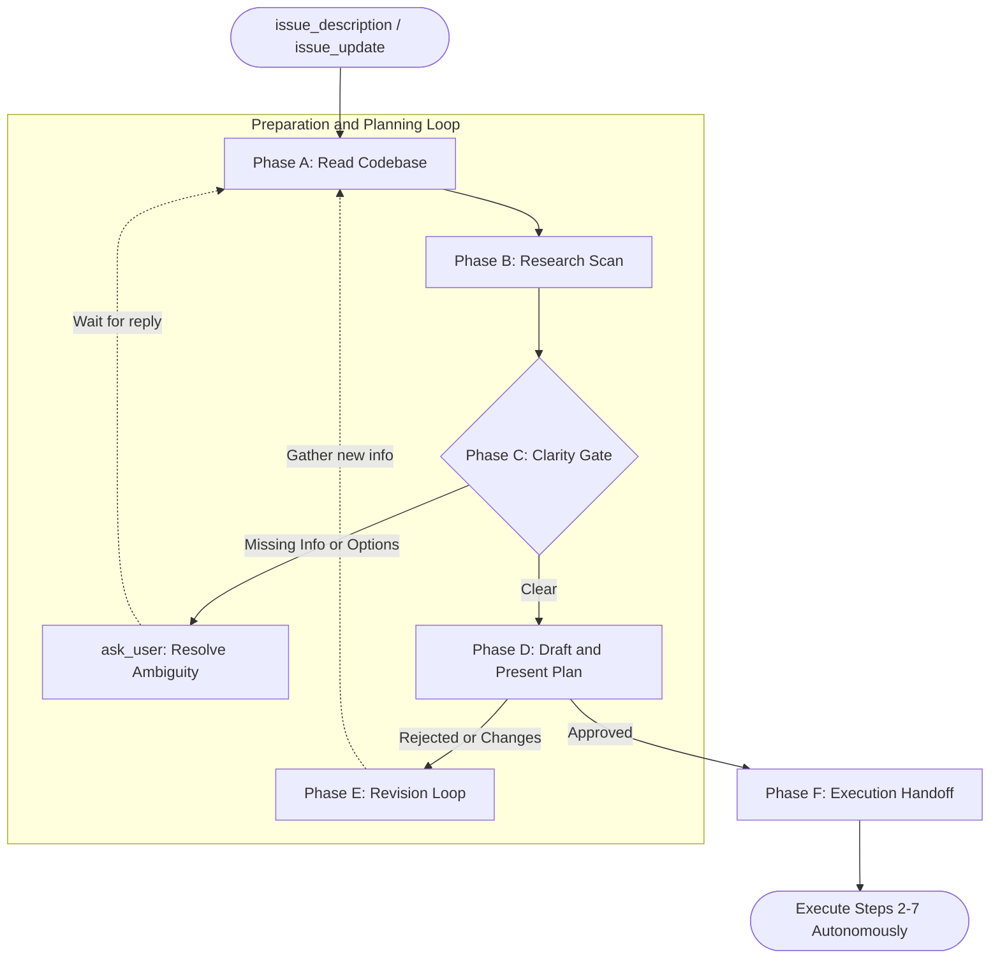

# Workflow Rules

## Preparation and Planning Loop [OVERRIDE]

Supersedes `[CODE]` Step 1 (hidden plan creation without user confirmation).

Before writing or editing any file, complete these steps in order:

### The Workflow Map

### Phase A: Read Codebase
Read all files relevant to the task. Understand the current implementation, structure, and dependencies. Never modify a file you have not read. (If you return here from Phase E, read any *new* files required by the user's feedback).

### Phase B: Research Scan
Identify any third-party libraries, external APIs, or services the task involves.

- **New Requirement:** If the task requires implementing generic utilities, components, or complex logic (e.g., date handling, drag-and-drop, specific algorithms), **you must trigger the Research Skill first** (using Context7 or Web Search) to find mature open-source libraries.
- **Found existing Library:** If a suitable library is found, **pause planning**, and use `ask_user` to notify the user and ask if the library should be installed. **Do not reinvent the wheel.**
- **Found (known task dependency)** → look them up before planning (Context7 first, fall back to web search).
- **Not found / No library needed** → proceed.

*Do not rely on training knowledge for third-party library APIs or external service behavior.*

### Phase C: Clarity Gate (Pre-Plan Check)
Before building or presenting any plan, verify if you have enough information to proceed. If any of the following apply, use `ask_user` immediately:
- **Missing Requirements:** Required values are missing. Do not assume or infer.
- **Multiple Approaches:** The task has multiple valid approaches. Present options and let the user pick.
- **Infeasibility:** The requirement conflicts with the codebase. Stop and describe the conflict.

### Phase D: Plan Presentation
Apply the Planning Skill to produce a visible plan.
- **Initial Presentation:**
  For standard plans, use `ask_user` — not `update_status` — to present the plan and wait for confirmation.
  Do not proceed to execute or modify any files until the user explicitly confirms.
- **Large or Complex Plans:**
  If the plan is large, contains multiple phases, or includes complex formatting like code blocks, do not force it into `ask_user` as information may be lost. Instead, switch to `[ADVANCED_CHAT]` mode and use the `answer` tool to output the complete Markdown plan.
  At the end of the answer, explicitly ask the user to review and reply with their approval. If approved, switch back to `[CODE]` mode to begin Phase F. If the user requests changes, proceed to Phase E.

### Phase E: Revision Loop
If the user requests changes to the plan, rejects it, or provides new constraints:
**Negative Constraint:** NEVER treat a message containing new requirements or additional context as an implicit approval to proceed, you must treat it as feedback.
1. Identify what new context is needed to address the feedback.
2. Loop back to **Phase A & B** to read additional files or perform new research.
3. Update the plan accordingly and return to **Phase D** to present it again.
4. Repeat this loop until explicit approval is granted.

### Phase F: Execution Handoff
**Only after explicit confirmation**, use the `update_status` tool to officially publish the approved plan (following the system's required formatting).
Then execute `[CODE]` Steps 2–7 autonomously, updating the status as you progress.

## Making Changes & Refactoring [OVERRIDE]

Supersedes `[CODE]` Step 4 (Implement the minimal changes).

- **Prefer DRY (Don't Repeat Yourself) over patching:** When duplicating logic or expanding existing conditionals, prioritize refactoring it into a reusable function or module (Reuse Before Writing) over simply adding more `if/else` statements.
- **One concern at a time.** If you notice two problems, fix one completely before touching the other.
- **Match existing conventions.** However, if existing conventions contain significant duplication, you are authorized and encouraged to propose refactoring.
