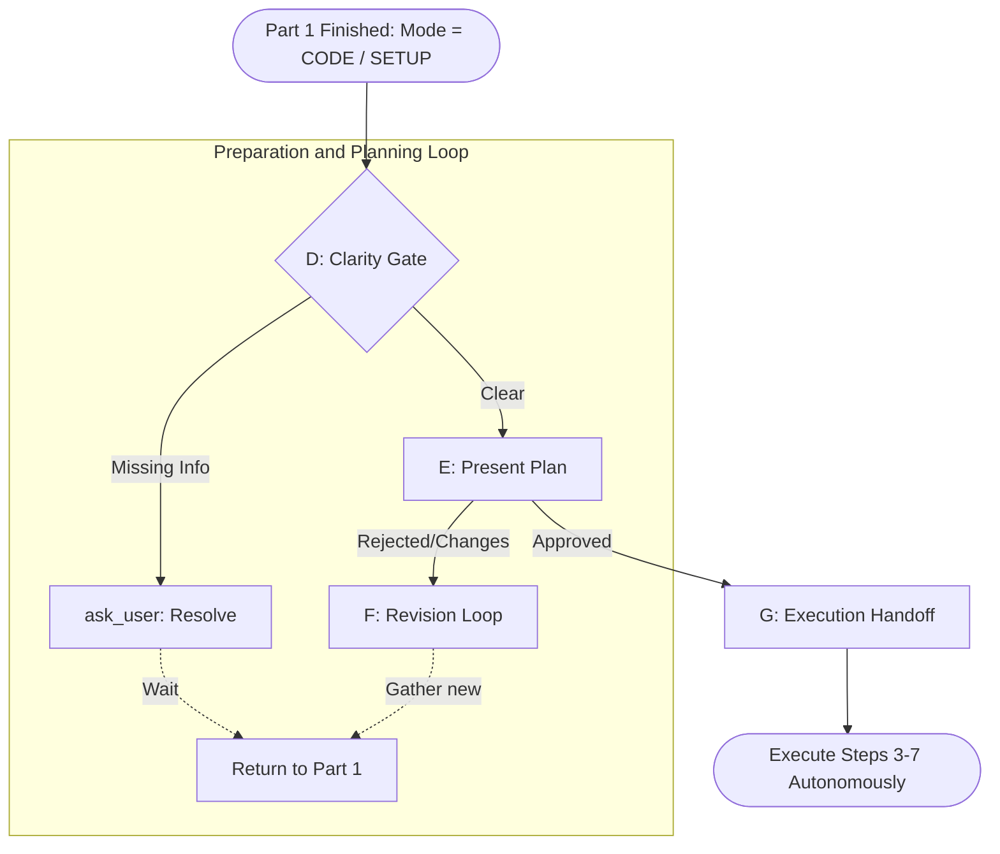

# Workflow Rules

## Part 1: Universal Analysis (All Modes) [OVERRIDE]
Supersedes System Prompt `[FAST_CODE]` workflow constraint ("without gathering extra information").
When receiving ANY `<issue_description>` or `<issue_update>`, ALWAYS execute these steps first to gather context, regardless of the chosen interaction mode:

### Phase A: Context Gathering (Read Codebase)
Read ALL relevant files. NEVER modify or answer about an unread file. (If returning from Phase F, read new targets).

### Phase B: Research Scan (MANDATORY)
Identify 3rd-party libraries, APIs, or services.
- **New Requirement / API Query:** If the task involves a third-party API (no matter how familiar you are with it), you **MUST** trigger Research Skill before entering thought or answering.
- **Anti-Hallucination Check:** In your internal monologue, you must explicitly write: "*This is a problem involving an external API, I must verify using tools first, and cannot rely on training data.*" and then call the tool immediately.
- **Found existing Library:** PAUSE planning. `ask_user` if we should install it. DO NOT reinvent the wheel.
- **Not found / None needed:** Proceed.
*NO training data for 3rd-party APIs.*

### Phase C: Mode Classification
Decide the final mode based on Mode Classification Rules.
**CRITICAL**: Mode classification is STRICTLY based on the presence of an explicit command. Proactivity rules DO NOT grant permission to modify files in non-modification modes. Proactive changes are ONLY allowed after legally entering `[CODE]` or `[SETUP]`.
- If entering `[ADVANCED_CHAT]`, `[CHAT]`, or `[RUN_VERIFY]` without modifications -> Proceed to output.
- If modifications are required -> Enter Part 2.

## Part 2: Preparation and Planning Loop [OVERRIDE]
Supersedes `[CODE]` Steps 1 and 2 (hidden plan, review codebase). Complete before editing any code or configuration.
*(Note: If the task perfectly matches the strict `[FAST_CODE]` whitelist, you may skip Part 2 entirely and execute directly.)*

### The Modification Workflow Map

### Phase D: Clarity Gate
STOP and `ask_user` if:
- **Missing Requirements:** DO NOT assume values.
- **Multiple Approaches:** Present options.
- **Infeasibility:** Conflicts with codebase.

### Phase E: Plan Presentation (Mandatory Planning Skill)
**FORCE TRIGGER Planning Skill here, regardless of modification size.** Wait for explicit approval before execution.
- **Standard:** Use `ask_user` to present plan. Even for 1-line changes, present what will change.
- **Test Strategy:** Explicitly include the test strategy (what to test, how to test) as part of the plan.
- **Large/Complex (multi-phase/code blocks):** Switch to `[ADVANCED_CHAT]`, use `answer` tool, and explicitly ask for approval. If approved -> `[CODE]` Phase G. If changes -> Phase F.

### Phase F: Revision Loop
If user requests changes/adds constraints:
**NEVER** treat new requirements as implicit approval to proceed.
1. Identify missing context.
2. Loop back to Part 1 (Phase A/B) to read/research.
3. Update plan & return to Phase E.
4. Repeat until explicit approval.

### Phase G: Execution Handoff
**ONLY after explicit confirmation:** Use `update_status` to publish plan.
Execute `[CODE]` Steps 3–7 autonomously.

## Making Changes & Refactoring [OVERRIDE]
Supersedes `[CODE]` Step 4 (Implement minimal changes).
- **Prefer DRY:** Refactor duplicated logic to shared utility BEFORE adding more `if/else`.
- **One concern at a time:** Fix one problem completely before touching another.
- **Match conventions:** (Unless conventions duplicate heavily, then propose refactor).

